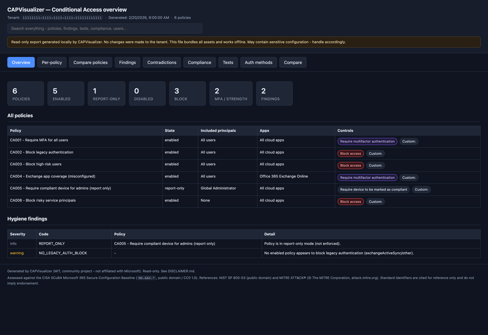
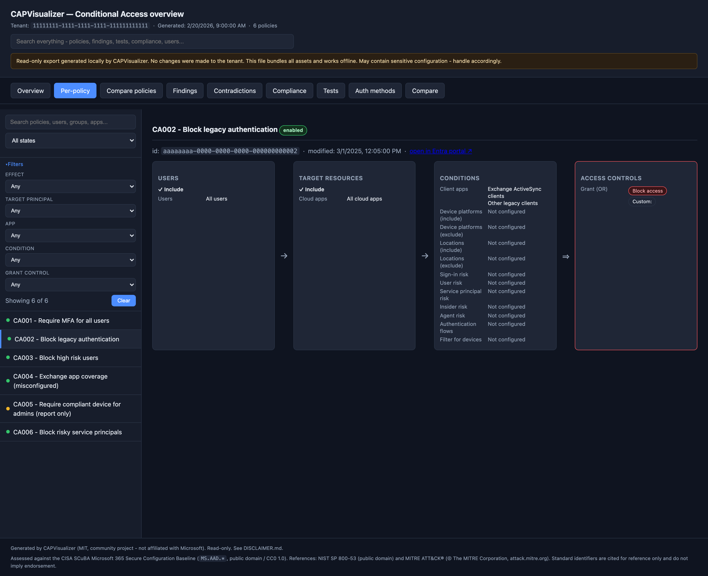
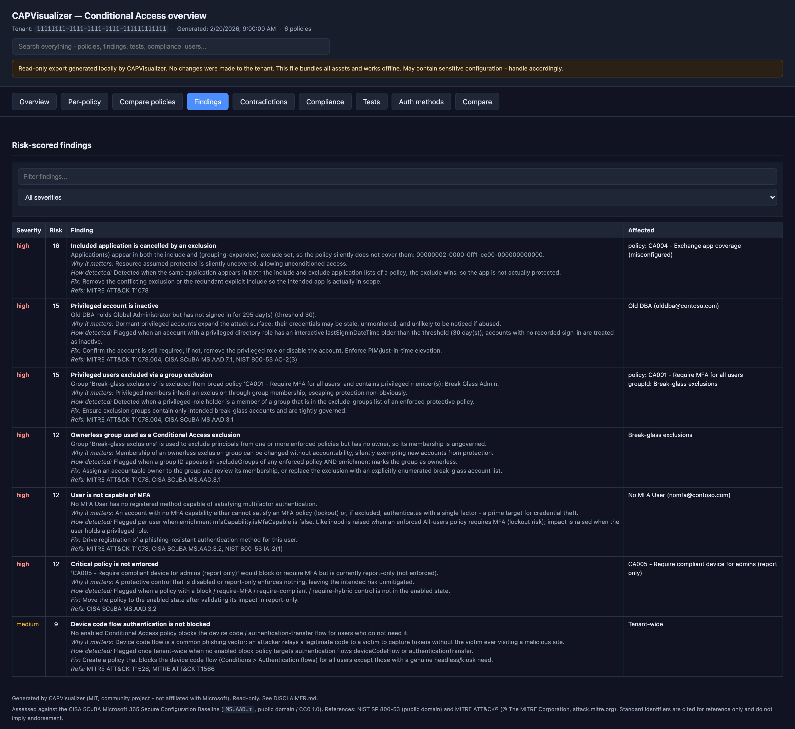
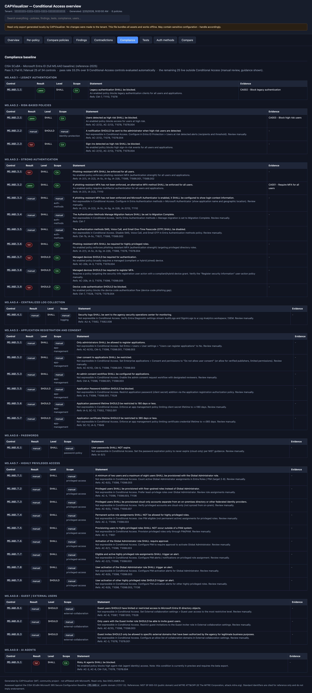
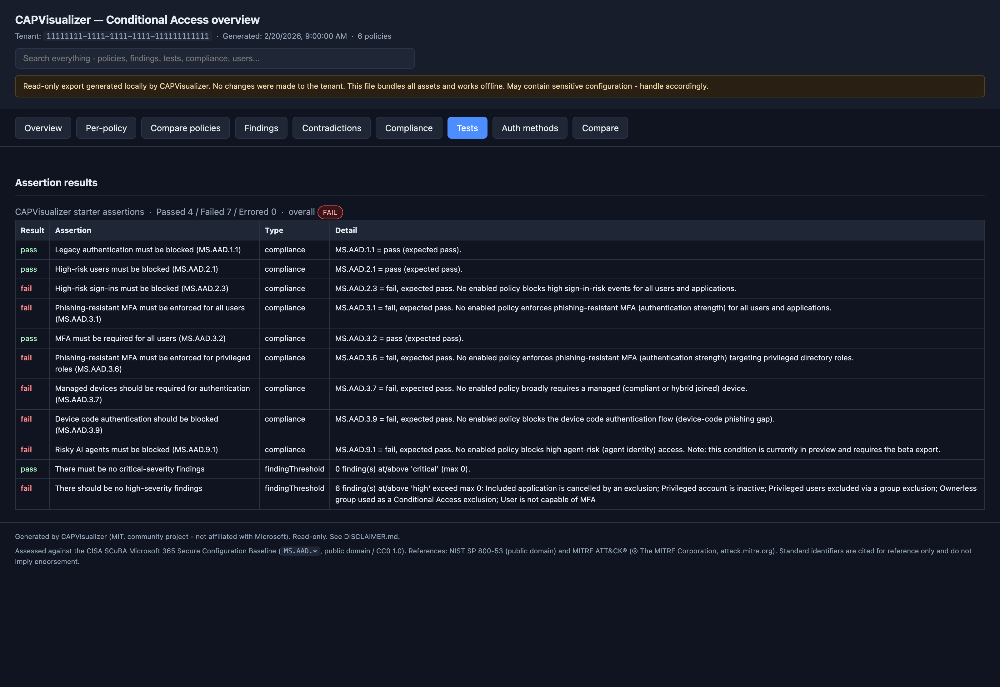
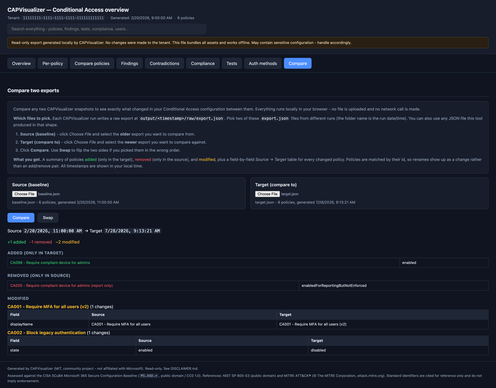
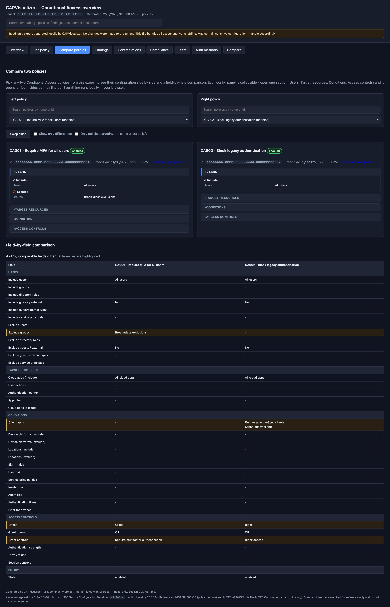
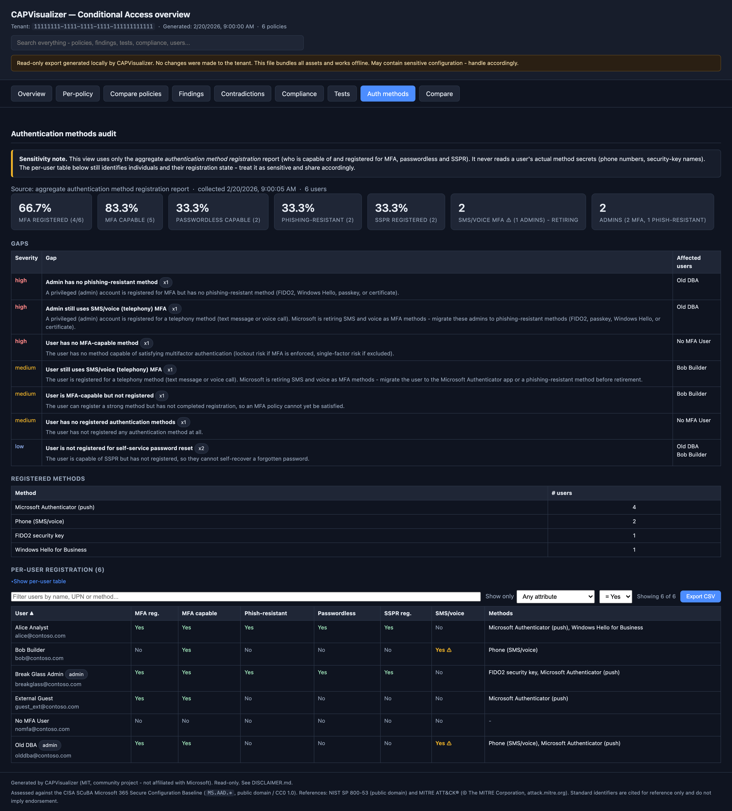

# CAPVisualizer

**Export, report on, and visualize all your Microsoft Entra Conditional Access
(CA) policies - fully locally, read-only, and shareable.**

CAPVisualizer is a PowerShell 7 toolkit you download and run on your own
machine. It reads every Conditional Access policy from your Entra tenant and
produces:

- **Detailed reports** in both **JSON** and **CSV** (targets, conditions, grant
  and session controls, blocks, hygiene findings).
- A **self-contained offline HTML** visualization - each policy individually and
  an overview of all of them - that opens in any browser with **no internet**.
  Every assignment, condition, grant and session control is shown with the same
  friendly wording as the Entra portal.
- **Delta reports** so periodic runs show exactly what changed since last time.
- An **offline render mode** (`-FromJson`) that rebuilds the full report + HTML
  from an existing JSON export - **no sign-in, no permissions, no network**.

> [!IMPORTANT]
> CAPVisualizer is **read-only** and runs **entirely locally**. It makes **no
> changes** to your tenant and **shares nothing online** during a run. Please
> read the [Disclaimer](DISCLAIMER.md) before using it. Community project - **not
> affiliated with Microsoft**. Provided "as is", no warranty (MIT).

---

## Contents

- [Why](#why) - purpose
- [Screenshots](#screenshots) - what the viewer looks like
- [Quickstart](#quickstart) - the three commands
- [Lowest-privilege by design](#lowest-privilege-by-design) - permissions
- [What each run produces](#what-each-run-produces) - output layout
- [Features](#features)
- [Offline analysis engines](#offline-analysis-engines) - scope, what-if, audit, findings, compliance, tests
- [Capability parity & independence](#capability-parity) - how it compares, what is original
- [How to run](#how-to-run) - all entry points and switches
- [Layout](#layout) - repository map
- [Requirements](#requirements)
- [Try it without a tenant](#try-it-without-a-tenant)
- [Security, privacy & disclaimer](#security-privacy--disclaimer)
- [License](#license)

---

## Why

Conditional Access is the front door of an Entra tenant, but its policies are
hard to review at a glance and drift over time. CAPVisualizer gives you a
point-in-time, offline, auditable picture of your CA posture - and a diff
between snapshots - using the **lowest possible permissions**.

## Screenshots

The offline HTML viewer is fully self-contained and works with no internet. All
images below are rendered from the bundled synthetic sample
(`samples/sample-export-enriched.json`); no real tenant data is shown.

**Overview** - policy inventory, state counts, hygiene findings at a glance:



**Per-policy** - each policy as a Users -> Target resources -> Conditions ->
Access controls flow, with every condition always shown (even when unset). For
larger tenants the sidebar has a faceted filter panel: search across policy
names and referenced users/groups/apps, and filter by state, effect
(block/grant), a specific target principal (user, group, or directory role), a
specific app, a condition type (location, device platform, risk, device filter,
legacy-auth), or a grant control. Object filters match both include and exclude
and badge each result (`targets` / `excluded`), with a live "Showing N of M"
count:



**Findings** - risk-scored posture gaps, grouped and with collapsible affected
lists. Every finding is self-explaining: it shows a plain-language description,
*Why it matters*, and *How detected* (the exact rule that fired), plus the fix
and standards references - so a collapsed "x29" row still explains itself
without cross-referencing the source. Checks include inactive **and** disabled
privileged accounts, MFA-incapable users, unblocked legacy/device-code flows,
and every promoted contradiction/exemption:



**Compliance** - the full CISA SCuBA `MS.AAD.*` baseline: Conditional Access
controls scored automatically, the rest listed as manual with official guidance:



**Tests** - assertion-pack results over the exported configuration:



**Compare** - pick any two export files in the browser and get a comparison
list: policies added, removed, and modified, with a field-level Source -> Target
table (works fully offline, nothing is uploaded, timestamps shown in local time):



**Compare policies** - pick any two policies *within the same export* from
searchable dropdowns and compare them side by side. Each policy is shown as
collapsible Users / Target resources / Conditions / Access controls cards (open
one section and both sides expand it in sync to save vertical space), with a
field-by-field table below that lists matching and differing settings and
highlights the differences. A "Show only differences" toggle collapses the
table to just the fields that diverge. Ideal for spotting duplicate or
near-duplicate policies that are candidates for consolidation. A **"Only
policies targeting the same users as left"** toggle restricts the right-hand
dropdown to policies with an identical include-user/group/role targeting set, so
overlapping or redundant policies surface immediately.



**Auth methods** - an authentication-method registration audit: tenant rollup
(MFA registered/capable, passwordless, phishing-resistant, SSPR), prioritized
gaps (admins without phishing-resistant methods, users not registered), a
method breakdown, and a per-user table. Users still relying on **SMS/voice
(telephony) MFA are red-flagged** - Microsoft is retiring those methods - with a
dedicated rollup card, an SMS/voice column per user, and separate gaps for
admins (high) and standard users (medium). The per-user table supports free-text
search, sortable columns, a "show only" attribute filter (for example, show
only users who are not MFA-capable), and one-click CSV export of the current
(filtered) view. Uses only the aggregate registration report, never a user's
actual method secrets. See
[docs/AUTHMETHODS.md](docs/AUTHMETHODS.md):



## Quickstart

```bash
# 1. Check prerequisites (PowerShell 7 + Microsoft.Graph.Authentication)
pwsh ./scripts/Test-Prerequisites.ps1 -Install

# 2. Export + report + visualize (interactive read-only sign-in)
pwsh ./scripts/Invoke-CapVisualizer.ps1

# 3. Open the result
#    output/<timestamp>/visual/index.html
```

Names are resolved by default; add `-Delta` to compare against your previous
run, or `-SkipResolveNames` for the minimal `Policy.Read.All`-only footprint.
No consent to spare? Render from a JSON file you already have with
`-FromJson ./policies.json` (fully offline). Full options in
[docs/USAGE.md](docs/USAGE.md).

> [!NOTE]
> **Expect two sign-in prompts on the first run.** Steps 1 and 2 are separate
> scripts that each run in their own process and sign in independently, so the
> token from the prerequisites check is not reused by the actual run. The run
> also requests the extra read-only scopes it needs for name resolution and
> enrichment (for example `Directory.Read.All`), so the second prompt may also
> ask for consent. This is expected and read-only. To get a **single** sign-in,
> skip step 1 and run `Invoke-CapVisualizer.ps1` directly; later runs are quieter
> once the token is cached and consent is granted. See
> [docs/PERMISSIONS.md](docs/PERMISSIONS.md#why-am-i-prompted-to-sign-in-twice).

## Lowest-privilege by design

| Feature | Graph scope | Read-only |
|---------|-------------|-----------|
| Core export / report / visual / delta | `Policy.Read.All` | ✅ |
| Name resolution (default; GUID → display name) | `Directory.Read.All` (or narrower) | ✅ |

No write scopes are ever requested. Use `-SkipResolveNames` for the minimal
`Policy.Read.All`-only footprint. Details: [docs/PERMISSIONS.md](docs/PERMISSIONS.md).

## What each run produces

```
output/<yyyyMMdd-HHmmss>/
  raw/export.json          # verbatim Graph data + directory enrichment
  report/policies.json     # enriched, analysis-ready
  report/policies.csv      # one flattened row per policy
  report/findings.json/csv # hygiene / gap findings
  report/summary.json      # counts and overview
  analysis/audit.json      # contradictions + exemption exposure
  analysis/consolidation.json # duplicates, overlaps, merge candidates, dead weight, gaps
  analysis/findings.json   # risk-scored findings (impact x likelihood)
  analysis/compliance.json # CISA SCuBA (MS.AAD.*) control results
  analysis/tests.json      # assertion results (+ .junit.xml / .sarif.json)
  delta/delta.json         # when -Delta and a baseline exist
  visual/index.html        # self-contained offline viewer (all tabs)
  manifest.json            # SHA-256 of every output file
  transcript.txt           # run log (unless -NoTranscript)
```

## Features

- **Full CA export** - policies plus dependencies (named locations,
  authentication strengths, authentication context references).
- **JSON + CSV reports** - both machine- and spreadsheet-friendly.
- **Offline HTML visualization** - per-policy assignment → condition → control
  flow, plus an all-policies overview. Zero external requests (no CDN).
- **Delta / periodic** - immutable timestamped snapshots and field-level diffs
  between runs. See [docs/DELTA.md](docs/DELTA.md).
- **In-browser Compare** - the offline viewer can load any two export files and
  list added, removed, and modified policies with field-level changes, without
  re-running the tool.
- **Side-by-side policy compare** - pick any two policies from the same export
  and diff them field by field in the browser, with a "show only differences"
  toggle and a same-targeting filter to surface consolidation candidates.
- **Hygiene / gap checks** - flags report-only/disabled policies, enabled
  policies with no controls, missing legacy-auth block, and "All users" targeting
  with no break-glass exclusion. Flags only - never changes anything.
- **Interactive or unattended auth** - delegated sign-in by default; app
  registration (certificate or secret) for scheduled runs.
- **Redaction** (`-Redact`) - strip tenant id and object GUIDs to share safely.
- **Integrity manifest** - SHA-256 of every output file.
- **Local scheduling helper** - cron / Task Scheduler. See
  [docs/SCHEDULING.md](docs/SCHEDULING.md).
- **Cross-platform** - PowerShell 7 on macOS, Linux, Windows.

## Offline analysis engines

Beyond export and reporting, every run also performs offline reasoning over the
normalized policy set and the read-only directory enrichment - no extra tools, no
network, reproducible from a JSON export via `-FromJson`:

- **Per-user scope** ([docs/SCOPE.md](docs/SCOPE.md)) - which policies actually
  target a principal (direct / via group or role / excluded). `Get-CapUserScope.ps1`.
- **What-if** ([docs/WHATIF.md](docs/WHATIF.md)) - simulate one sign-in; separates
  *definitive* from *signal-dependent* outcomes. `Invoke-CapWhatIf.ps1`.
- **Gap permutation** ([docs/ANALYZE.md](docs/ANALYZE.md)) - permute unspecified
  signals to surface bypasses and no-enforcement paths. `Invoke-CapAnalyze.ps1`.
- **Contradiction audit** ([docs/AUDIT.md](docs/AUDIT.md)) - self-defeating
  include/exclude overlaps, legacy-auth gaps, exemption exposure.
- **Rationalization & consolidation** ([docs/CONSOLIDATE.md](docs/CONSOLIDATE.md)) -
  cross-policy compare to cluster exact duplicates, same-effect overlaps and safe
  merge candidates, flag dead weight, check baseline completeness (device-code
  flow, risk, admin auth strength, ...) and rank exclusion concentration, with an
  estimated before -> after policy count. `Invoke-CapConsolidate.ps1`.
- **Risk-scored findings** ([docs/FINDINGS.md](docs/FINDINGS.md)) - deterministic
  impact x likelihood model with MITRE / CISA / NIST references. Every finding
  carries a plain-language summary, *why it matters*, and *how it was detected*
  (the exact rule), and covers inactive/disabled privileged accounts, MFA gaps,
  and unblocked legacy/device-code flows.
- **Compliance baseline** ([docs/COMPLIANCE.md](docs/COMPLIANCE.md)) - the full
  CISA SCuBA `MS.AAD.*` control set, evaluated from a versioned baseline pack.
  Conditional Access controls are scored automatically; controls that live
  outside Conditional Access are listed as manual with official guidance so the
  matrix covers everything, not only what CA can enforce.
- **Assertion engine** ([docs/TESTING.md](docs/TESTING.md)) - declarative JSON
  assertions with JUnit / SARIF / JSON output and CI exit codes.
  `Invoke-CapTest.ps1`.
- **Auth methods audit** ([docs/AUTHMETHODS.md](docs/AUTHMETHODS.md)) - who is
  registered/capable for MFA, passwordless, phishing-resistant methods and SSPR,
  plus who still relies on the retiring SMS/voice (telephony) methods, with
  prioritized gaps and a per-user table, from the aggregate registration
  report (never a user's actual method secrets).

These are surfaced as extra tabs in the offline viewer and as `analysis/*.json`
files. (Rationalization output is written to `analysis/consolidation.json` and as
reviewer CSVs; it is not yet a dedicated viewer tab.)

### Capability parity

Each engine reproduces the *result and intent* of a well-known community tool,
**authored independently** from public Entra behaviour and open standards:

| CAPVisualizer pillar        | Mirrors the result of | Public standards referenced          |
| --------------------------- | --------------------- | ------------------------------------ |
| Scope / what-if / gap       | CAPSlock (SpecterOps) | Entra CA evaluation model            |
| Contradiction audit         | noCAP                 | Entra CA assignment model            |
| Risk-scored findings        | EntraFalcon           | MITRE ATT&CK, CISA SCuBA, NIST 800-53 |
| Compliance baseline         | ScubaGear             | CISA SCuBA `MS.AAD.*`, NIST 800-53   |
| Assertion / test engine     | Maester               | JUnit, SARIF 2.1.0                   |

> [!NOTE]
> **Independence statement.** No source code, algorithm, or configuration is
> copied from CAPSlock, noCAP, EntraFalcon, ScubaGear, Maester, or any other
> tool. Only observable behaviour and **public** standards - CISA SCuBA control
> IDs (`MS.AAD.*`), NIST 800-53 controls, MITRE ATT&CK technique IDs, and the
> JUnit/SARIF output formats - are referenced. BloodHound/AzureHound and
> ROADtools are explicitly out of scope. Everything stays read-only and offline.
>
> Tool names referenced for comparison only - **CAPSlock**/**SpecterOps**,
> **noCAP**, **EntraFalcon**, **ScubaGear** (CISA), and **Maester** - are the
> trademarks or property of their respective owners. CAPVisualizer is not
> affiliated with, endorsed by, or derived from any of them.

## How to run

Everything runs locally with PowerShell 7 (`pwsh`). Full reference in
[docs/USAGE.md](docs/USAGE.md); permissions in
[docs/PERMISSIONS.md](docs/PERMISSIONS.md).

**Main workflow (export → report → analysis → visual):**

```bash
pwsh ./scripts/Test-Prerequisites.ps1 -Install     # one-time: PS7 + Graph auth module
pwsh ./scripts/Invoke-CapVisualizer.ps1            # interactive read-only sign-in
pwsh ./scripts/Invoke-CapVisualizer.ps1 -FromJson ./export.json   # offline, zero permissions
```

| Common switch | Effect |
| ------------- | ------ |
| `-FromJson <path>` | Offline render from an existing export - no sign-in, no network. |
| `-SkipResolveNames` | Show GUIDs; request only `Policy.Read.All`. |
| `-Delta` / `-BaselinePath <folder>` | Diff against the previous (or a chosen) snapshot. |
| `-Redact` | Replace tenant id and object GUIDs with stable pseudonyms (safe to share). |
| `-SkipAnalysis` | Export + report + visual only (skip the analysis engines). |
| `-AssertionPath <path>` | Custom assertion pack for the built-in test engine. |
| `-NoVisual` / `-NoTranscript` | Skip HTML / skip the transcript. |
| `-NoOpen` | Do not auto-open the report in the browser (opens by default on interactive runs). |
| `-TenantId`/`-ClientId`/`-CertificateThumbprint` | Unattended app-registration auth. |

**Standalone analysis engines** (each runs offline against an export):

```bash
pwsh ./scripts/Get-CapUserScope.ps1 -FromJson ./export.json -PrincipalId <object-id>
pwsh ./scripts/Invoke-CapWhatIf.ps1 -FromJson ./export.json -PrincipalId <object-id> -Resource <app-id>
pwsh ./scripts/Invoke-CapAnalyze.ps1 -FromJson ./export.json
pwsh ./scripts/Invoke-CapConsolidate.ps1 -FromJson ./export.json
pwsh ./scripts/Invoke-CapTest.ps1    -FromJson ./export.json -AssertionPath ./assertions.json
pwsh ./scripts/Compare-CapSnapshot.ps1 -BaselinePath output/<a> -CurrentPath output/<b>
```

## Layout

```
scripts/
  Invoke-CapVisualizer.ps1     # entry point (export → enrich → report → analysis → visual → delta)
  Test-Prerequisites.ps1       # environment / connectivity doctor
  Compare-CapSnapshot.ps1      # diff two existing snapshots
  Register-CapSchedule.ps1     # local cron / Task Scheduler helper
  Get-CapUserScope.ps1         # per-user policy scope (offline)
  Invoke-CapWhatIf.ps1         # simulate one sign-in (offline)
  Invoke-CapAnalyze.ps1        # gap permutation (offline)
  Invoke-CapConsolidate.ps1    # duplicate / overlap / merge / dead-weight analysis (offline)
  Invoke-CapTest.ps1           # assertion engine, CI exit codes
  modules/
    CapCommon.psm1             # auth, Graph paging, throttling, hashing, name resolution
    CapExport.psm1             # fetch CA policies + dependencies + directory enrichment
    CapNormalize.psm1          # canonical policy shape (the analysis gate)
    CapReport.psm1             # JSON/CSV reports + hygiene checks + summary
    CapScope.psm1              # per-user scope resolution
    CapWhatIf.psm1             # offline what-if evaluation
    CapAnalyze.psm1            # gap / bypass permutation
    CapAudit.psm1              # contradiction & exemption audit
    CapConsolidate.psm1        # cross-policy rationalization & consolidation
    CapFindings.psm1           # risk-scored findings model
    CapCompliance.psm1         # CISA SCuBA baseline evaluation
    CapAuthMethods.psm1        # authentication-method registration audit
    CapTest.psm1               # assertion engine (JUnit/SARIF/JSON)
    CapVisual.psm1             # render self-contained offline HTML
    CapDelta.psm1              # snapshot comparison engine
assets/                        # HTML template + inlined CSS/JS (offline)
  reference/                   # app groupings, privileged roles, baselines, assertions
arm/                           # OPTIONAL, opt-in Azure scheduling (not local)
docs/                          # USAGE, PERMISSIONS, SCOPE, WHATIF, ANALYZE, AUDIT, CONSOLIDATE, FINDINGS, COMPLIANCE, TESTING, DELTA, SCHEDULING, SECURITY
samples/                       # sanitized sample export + offline self-test
```

## Changelogs

The tool has two components with independent release notes, because a change to one
does not necessarily affect the other:

- **[CHANGELOG-EXPORT.md](CHANGELOG-EXPORT.md)** — the **collector** (Entra → JSON).
  Entries here change *what is collected or the JSON shape* and mean you should take a
  **fresh export**; the contract is stamped at `metadata.schemaVersion`.
- **[CHANGELOG-REPORT.md](CHANGELOG-REPORT.md)** — the **analyzer / report** (JSON →
  findings & HTML). Entries here change *how an existing export is analysed or
  presented* and need **no new export** — just re-run `-FromJson` on your snapshot.

## Requirements

- [PowerShell 7+](https://learn.microsoft.com/powershell/scripting/install/installing-powershell)
- `Microsoft.Graph.Authentication` module (`Install-Module Microsoft.Graph.Authentication -Scope CurrentUser`)
- An Entra account (or app registration) that can **read** CA policies.

## Try it without a tenant

Render the viewer and reports from bundled sample data (no sign-in):

```bash
pwsh ./samples/Test-Offline.ps1
# open samples/sample-visual.html
```

## Security, privacy & disclaimer

- **Read-only.** Only `GET` requests (plus one read-only `getByIds` name lookup)
  are made against **your own tenant's** Microsoft Graph endpoint. No create,
  update, or delete calls are ever issued - the tool cannot change your tenant.
- **Local & offline.** Nothing is uploaded, there is no telemetry and no
  phone-home. The HTML viewer inlines all assets (no CDN) and opens with no
  internet. `-FromJson` reproduces everything with zero network access.
- **Sensitive output.** Exports and reports can contain sensitive configuration
  (targeting, exclusions, break-glass accounts, object IDs). `output/` is
  git-ignored; use `-Redact` before sharing outside your tenant.
- **Least privilege.** Core export needs only `Policy.Read.All`; optional
  read-only directory scopes power name resolution and the analysis engines. See
  [docs/PERMISSIONS.md](docs/PERMISSIONS.md).
- **No warranty.** Provided "as is" under the MIT license; review the code and
  validate behaviour before running against production.

Full details: [docs/SECURITY.md](docs/SECURITY.md) and the
[Disclaimer](DISCLAIMER.md).

## Optional cloud scheduling

A fully-local schedule is the default. If you specifically want the run to
happen **in Azure** (leaving the local-only model), an opt-in ARM/Bicep template
is provided. It only scaffolds the resources - the runbook, Graph permission,
module, and schedule link are deliberately manual. See
[`arm/README.md`](arm/README.md) for the template, all configuration details,
the required post-deployment steps, and the **Deploy to Azure** button.

## License

[MIT](LICENSE). Not affiliated with or endorsed by Microsoft.
