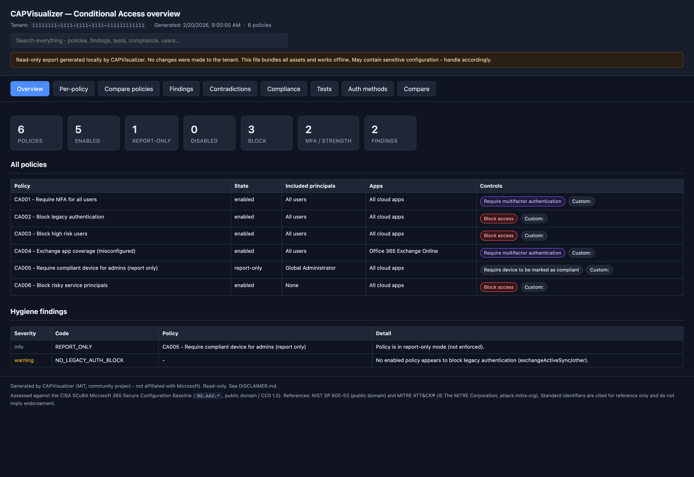
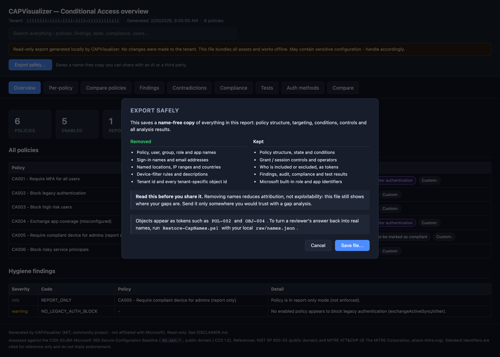

# CAPVisualizer

**A read-only, local toolkit for exporting, understanding, testing, and reviewing
Microsoft Entra Conditional Access.**

CAPVisualizer collects Conditional Access configuration from Microsoft Graph,
normalizes the different Graph shapes, runs deterministic offline analysis, and
builds a self-contained HTML report. It does not change the tenant, upload data,
use telemetry, or require an AI model.

> [!IMPORTANT]
> This is a community project, not a Microsoft product. Review the
> [disclaimer](DISCLAIMER.md) before using it in production. All tenant output is
> sensitive. Only artifacts created by **Export safely** or
> `Export-CapSafeBundle.ps1` are intended to leave your machine.



## Quickstart

Requirements: PowerShell 7 and the `Microsoft.Graph.Authentication` module.

```powershell
# Optional environment and connectivity check
pwsh ./scripts/Test-Prerequisites.ps1 -Install

# Read-only interactive collection, analysis, and report
pwsh ./scripts/Invoke-CapVisualizer.ps1

# Open output/<timestamp>/visual/index.html
```

The default run includes the read-only directory context needed by the analysis
engines. A policy-only mode with fewer permissions is also available; see
[Permissions](#permissions) for the exact trade-off.

No tenant access available? Render a previously collected export with no
authentication or network access. Point `-FromJson` at the snapshot folder so
CAPVisualizer can also find its local name dictionary:

```powershell
pwsh ./scripts/Invoke-CapVisualizer.ps1 `
  -FromJson ./output/20261005-120000
```

Full command reference: [docs/USAGE.md](docs/USAGE.md). Built-in help:

```powershell
Get-Help ./scripts/Invoke-CapVisualizer.ps1 -Full
Get-Help ./scripts/Invoke-CapVisualizer.ps1 -Examples
```

## What it does

| Capability | What it provides |
| --- | --- |
| **Conditional Access collection** | Exports policies plus named-location references, authentication strengths, and authentication contexts. |
| **Directory enrichment** | Optionally collects users, groups, owners, privileged-role assignments, sign-in activity, and aggregate authentication-method registration data. |
| **JSON and CSV reports** | Produces structured machine-readable output and flattened tables for investigation or spreadsheet use. |
| **Offline HTML viewer** | Shows the estate overview and each policy as Users → Resources → Conditions → Controls, with no external web requests. |
| **Search and filters** | Finds policies by name, principal, role, application, state, condition, exclusion, or grant control. |
| **Snapshot delta** | Compares timestamped runs and reports policies and fields that were added, removed, or changed. |
| **Browser snapshot compare** | Loads two export files in the local viewer and compares them without rerunning collection. |
| **Policy-to-policy compare** | Compares two policies side by side and can restrict candidates to policies targeting the same principals. |
| **Hygiene checks** | Flags disabled/report-only policies, policies without controls, weak baseline coverage, and risky exclusions. |
| **Findings and compliance tabs** | Presents risk-scored findings, CISA SCuBA results, assertion results, and the evidence behind each conclusion. |
| **Authentication-method audit** | Reports MFA, passwordless, phishing-resistant, SSPR, and SMS/voice reliance from the aggregate registration report. It never reads users' method secrets. |
| **Sign-in-log KQL** | Provides copy-ready queries for policy usage, sign-ins with no applied CA policy, and sign-ins with no MFA enforcement. CAPVisualizer does not download sign-in logs. |
| **Safe export** | Builds a review artifact without display names, the tenant ID, directory inventory, named-location definitions, or IP ranges. |
| **Offline rerendering** | Recreates reports and analysis from JSON using `-FromJson`; a local `names.json` can restore readable names without reconnecting to Graph. |
| **Integrity manifest** | Records SHA-256 hashes for snapshot files so accidental changes or incomplete copies can be detected. |
| **Interactive and unattended auth** | Supports delegated browser/device-code sign-in and certificate-based application authentication for scheduled runs. |
| **Scheduling** | Includes local cron/Task Scheduler guidance and an optional Azure Automation scaffold. |
| **Cross-platform execution** | Runs under PowerShell 7 on Windows, macOS, and Linux. |

## Offline analysis engines

The same export always produces the same result. These engines run locally and
do not call a model or make tenant changes.

| Engine | Question answered | Details |
| --- | --- | --- |
| **Scope resolution** | Which policies include or exclude a specific user through direct, group, or role targeting? | [SCOPE.md](docs/SCOPE.md) |
| **What-if evaluation** | For a described sign-in, which policies definitely apply and which depend on missing signals? | [WHATIF.md](docs/WHATIF.md) |
| **Gap permutation** | Do combinations of platform, client, location, risk, or authentication-flow signals create uncovered paths? | [ANALYZE.md](docs/ANALYZE.md) |
| **Contradiction audit** | Are includes, exclusions, controls, or exemptions internally inconsistent or unexpectedly broad? | [AUDIT.md](docs/AUDIT.md) |
| **Consolidation** | Which policies are duplicates, overlaps, merge candidates, dead weight, or evidence of a missing baseline? | [CONSOLIDATE.md](docs/CONSOLIDATE.md) |
| **Risk-scored findings** | What configuration and identity-posture gaps exist, how were they detected, and why do they matter? | [FINDINGS.md](docs/FINDINGS.md) |
| **CISA SCuBA baseline** | Which `MS.AAD.*` controls can be evaluated automatically, and which require manual verification? | [COMPLIANCE.md](docs/COMPLIANCE.md) |
| **Assertion engine** | Does the export satisfy a versioned JSON policy-as-code test pack? Outputs JSON, JUnit, and SARIF. | [TESTING.md](docs/TESTING.md) |
| **Authentication methods** | Who is registered or capable for MFA, passwordless, phishing-resistant authentication, and SSPR? | [AUTHMETHODS.md](docs/AUTHMETHODS.md) |

The engine determines **what is true**. A human or other reviewer decides
**what to do about it**. See [docs/PROCESS.md](docs/PROCESS.md).

## How it works

```text
1. COLLECT    Read-only Microsoft Graph calls
      ↓
2. NORMALIZE  Fold Graph variants into one analysis shape
      ↓
3. ANALYZE    Deterministic offline engines
      ↓
4. RENDER     Self-contained local HTML
      ↓
5. EXPORT     Optional safe artifact for outside review
      ↓
6. RESTORE    Optional local mapping of aliases back to names
```

Stages 1-4 run with one command. Collection is the only stage that requires
network access. Stages 5-6 are optional and exist only when an outside reviewer
needs the assessment.

## Permissions

CAPVisualizer requests only Microsoft Graph **read** permissions. No directory,
policy, or Conditional Access write scope is used.

| Run type | Required delegated/application scopes | Command |
| --- | --- | --- |
| **Policy-only, IDs** | `Policy.Read.All` | `-SkipResolveNames -SkipDirectory` |
| **Policy-only, names** | `Policy.Read.All`, `Directory.Read.All` | `-SkipDirectory` |
| **Full analysis, default** | `Policy.Read.All`, `Directory.Read.All`, `Group.Read.All`, `User.Read.All`, `RoleManagement.Read.Directory`, `AuditLog.Read.All`, `UserAuthenticationMethod.Read.All` | No reduction switches |
| **Offline render** | None | `-FromJson <path>` |

Directory datasets are best-effort. If a scope is unavailable, dependent checks
report insufficient data instead of fabricating a result.

For interactive use, a read-capable role such as **Security Reader** or
**Global Reader** is sufficient when the scopes are consented. For unattended
runs, grant the equivalent application permissions to an app registration and
prefer certificate authentication.

Exact endpoints, narrower alternatives, and first-run consent behavior:
[docs/PERMISSIONS.md](docs/PERMISSIONS.md).

## Safe sharing

The local snapshot contains a detailed map of the tenant. A file without display
names is not automatically safe: tenant and object GUIDs can still identify the
organization and its security design.

| Artifact | Purpose | Share? |
| --- | --- | --- |
| `raw/export.json` | Local source data, including tenant and object IDs | **No** |
| `raw/names.json` | Local ID/alias-to-name dictionary | **Never** |
| `visual/index.html` | Local report, normally containing real names | **No** |
| `cap-safe-review-<snapshot>.json` | Allowlisted policy and analysis structure produced by **Export safely** | Intended for controlled review |
| `safe/` bundle | CLI-produced pseudonymized bundle; deleted if its leak checks fail | Intended for controlled review |

Recommended workflow:

1. Run CAPVisualizer normally.
2. In `visual/index.html`, select **Export safely**, or run:

   ```powershell
   pwsh ./scripts/Export-CapSafeBundle.ps1 -SnapshotPath ./output/<timestamp>
   ```

3. Share only the generated safe artifact.
4. If a returned report refers to aliases, restore names locally:

   ```powershell
   pwsh ./scripts/Restore-CapNames.ps1 `
     -Path ./review.md `
     -Names ./output/<timestamp>/raw/names.json `
     -InPlace
   ```

Safe export removes names, the explicit tenant ID, directory enrichment, named
location definitions, IP ranges, descriptions, and tenant-specific filter
expressions. It retains the policy structure needed for review. The remaining
security map is still sensitive, so use normal organizational handling rules.

Full threat boundary and field-level behavior:
[docs/SAFEEXPORT.md](docs/SAFEEXPORT.md) and
[docs/SECURITY.md](docs/SECURITY.md).



## Output

Each run creates an immutable timestamped snapshot:

```text
output/<yyyyMMdd-HHmmss>/
  raw/
    export.json               local source structure and enrichment
    names.json                local-only name dictionary
  report/
    policies.json             normalized policy report
    policies.csv              flattened policy inventory
    findings.json / .csv      report-level hygiene findings
    summary.json              counts and run metadata
  analysis/
    audit.json                contradictions and exemptions
    consolidation.json        duplicates, overlaps, merges, gaps
    findings.json             risk-scored posture findings
    compliance.json           CISA SCuBA evaluation
    authmethods.json          authentication registration posture
    tests.json                assertion results
  delta/delta.json            present when a baseline is compared
  visual/index.html           self-contained report
  manifest.json               file hashes and sensitivity metadata
  transcript.txt              run log unless disabled
```

`output/` is git-ignored. Protect it as sensitive tenant data.

## Common commands

```powershell
# Full interactive run
pwsh ./scripts/Invoke-CapVisualizer.ps1

# Compare with the latest previous snapshot
pwsh ./scripts/Invoke-CapVisualizer.ps1 -Delta

# Fully offline rerender
pwsh ./scripts/Invoke-CapVisualizer.ps1 `
  -FromJson ./output/20261005-120000

# Offline rerender with a separately stored dictionary
pwsh ./scripts/Invoke-CapVisualizer.ps1 `
  -FromJson ./cap-safe-review.json `
  -Names ./names.json

# Unattended certificate authentication
pwsh ./scripts/Invoke-CapVisualizer.ps1 `
  -TenantId contoso.onmicrosoft.com `
  -ClientId 11111111-2222-3333-4444-555555555555 `
  -CertificateThumbprint A1B2C3D4E5F6 `
  -Delta -NoOpen -NoTranscript

# Render the bundled synthetic sample, with no tenant access
pwsh ./samples/Test-Offline.ps1
```

Standalone engine commands and all switches:
[docs/USAGE.md](docs/USAGE.md).

## Repository map

```text
scripts/
  Invoke-CapVisualizer.ps1   main collection and reporting entry point
  Export-CapSafeBundle.ps1   create a checked sharing bundle
  Restore-CapNames.ps1       restore aliases locally
  Invoke-Cap*.ps1            standalone offline analysis commands
  modules/                   collection, normalization, analysis, reporting
assets/                      self-contained HTML/CSS/JavaScript viewer
assets/reference/            baselines, app groups, roles, assertions
docs/                        detailed operational and technical documentation
samples/                     sanitized data and offline demonstration
tests/                       offline Pester regression suite
arm/                         optional Azure Automation scaffold
```

## Documentation

| Topic | Document |
| --- | --- |
| End-to-end data and decision flow | [PROCESS.md](docs/PROCESS.md) |
| Commands, switches, and unattended use | [USAGE.md](docs/USAGE.md) |
| Graph permissions and directory roles | [PERMISSIONS.md](docs/PERMISSIONS.md) |
| Safe export and name restoration | [SAFEEXPORT.md](docs/SAFEEXPORT.md) |
| Security and privacy model | [SECURITY.md](docs/SECURITY.md) |
| Snapshot comparison | [DELTA.md](docs/DELTA.md) |
| Scheduling | [SCHEDULING.md](docs/SCHEDULING.md) |
| Collector changes requiring a fresh export | [CHANGELOG-EXPORT.md](CHANGELOG-EXPORT.md) |
| Analyzer/report changes reusable with existing JSON | [CHANGELOG-REPORT.md](CHANGELOG-REPORT.md) |

## Scope and independence

CAPVisualizer is independently implemented from public Microsoft Entra behavior,
Microsoft documentation, and open standards. Its engines address use cases also
covered by projects such as CAPSlock, noCAP, EntraFalcon, ScubaGear, and Maester,
but no source code or private implementation details from those projects are
used. Their names and trademarks belong to their respective owners.

BloodHound/AzureHound and ROADtools-style attack-path analysis are outside this
project's scope.

## Security and support

- Read-only Graph operations only; the one POST operation is the read-only
  `directoryObjects/getByIds` lookup.
- No telemetry, third-party upload, external JavaScript, or CDN dependency.
- Authentication tokens are managed by Microsoft Graph PowerShell, not written
  by CAPVisualizer.
- App-only automation should use a certificate rather than a client secret.
- Review the source and validate results before acting on production policy.

This project is provided **as is**, without warranty or official support.

## License

[MIT](LICENSE). Not affiliated with or endorsed by Microsoft.
