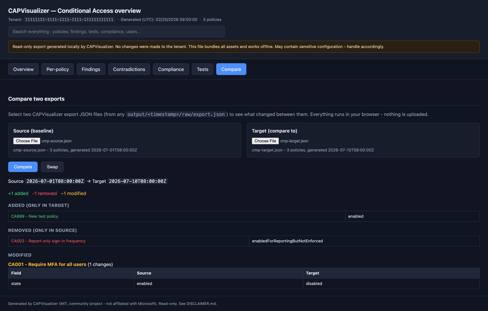

# Delta / periodic comparison

CAPVisualizer is built to run periodically and show **what changed** between
runs, so you can review Conditional Access drift over time.



## How snapshots work

Every run writes a separate, timestamped snapshot under `output/`:

```
output/20260101-090000/
output/20260201-090000/
output/20260301-090000/
```

The name-free, normalized collection in each snapshot's `raw/export.json` is
the source of truth used for comparisons. Snapshots are ordinary files rather
than write-protected storage; preserve or protect the folder if it is being used
as an audit trail.

## Automatic delta (against the previous run)

Add `-Delta`:

```bash
pwsh ./scripts/Invoke-CapVisualizer.ps1 -Delta
```

The tool picks the **most recent previous snapshot** as the baseline and writes
`delta/delta.json` in the new snapshot. The HTML viewer shows a **Delta** tab
with added / removed / modified policies and field-level changes.

## Explicit baseline

Pin the comparison to a specific earlier snapshot:

```bash
pwsh ./scripts/Invoke-CapVisualizer.ps1 -Delta -BaselinePath output/20260101-090000
```

## Compare two existing snapshots (no new export)

```bash
pwsh ./scripts/Compare-CapSnapshot.ps1 \
  -BaselinePath output/20260101-090000 \
  -CurrentPath  output/20260201-090000
```

Outputs `delta.json` and `delta-modified.csv` under the current snapshot's
`delta/` folder (or `-OutputPath`).

## What the delta reports

- **Added** - policies present now but not in the baseline.
- **Removed** - policies present in the baseline but gone now.
- **Modified** - policies whose configuration changed, with a per-field list of
  `field`, `from`, `to`. Array-valued fields are compared order-insensitively so
  reordering does not show as a change.

## Suggested cadence

Daily or weekly runs are typical. Combine with the scheduler helper - see
[SCHEDULING.md](SCHEDULING.md). Keep the `output/` history to build an audit
trail of CA changes over time.
