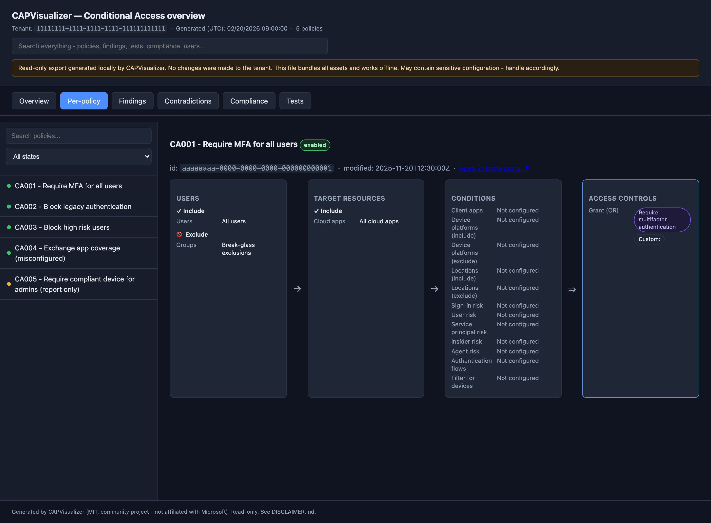

# Usage

All commands run locally with PowerShell 7 (`pwsh`). Nothing is uploaded.

## 1. Check prerequisites

```bash
pwsh ./scripts/Test-Prerequisites.ps1            # environment checks
pwsh ./scripts/Test-Prerequisites.ps1 -Install   # also install the Graph auth module for the current user
pwsh ./scripts/Test-Prerequisites.ps1 -TestConnection   # interactive read-only sign-in probe
```

If the module is missing:

```powershell
Install-Module Microsoft.Graph.Authentication -Scope CurrentUser
```

## 2. Run an export (interactive)

```bash
pwsh ./scripts/Invoke-CapVisualizer.ps1
```

You'll be prompted to sign in and consent to read-only Microsoft Graph scopes.
`Policy.Read.All` reads Conditional Access. `Directory.Read.All` resolves
object names, and the default full-analysis run requests additional read-only
directory/reporting scopes for groups, privileged roles, account state,
sign-in activity, and aggregate authentication-method registration. See
[PERMISSIONS.md](PERMISSIONS.md) for the exact scope-to-feature mapping.
By default sign-in uses the **system-browser authorization-code flow** (PKCE):
a single, SSO-aware browser prompt - the Microsoft-recommended interactive flow.
For headless / SSH sessions with no local browser, add `-UseDeviceCode` to fall
back to the device-code flow (prints a copy/paste URL + one-time code); note that
device-code flow is more phishing-prone, so use it only when necessary. Output
lands in a timestamped folder under `output/`.

### Useful switches

| Switch | Effect |
|--------|--------|
| `-SkipResolveNames` | Do **not** resolve names; show GUIDs. Combine with `-SkipDirectory` for a `Policy.Read.All`-only run. |
| `-UseDeviceCode` | Use the device-code flow (headless / SSH, no browser) instead of the default system-browser sign-in. |
| `-FromJson <path>` | Offline render mode: build reports + HTML from an existing snapshot folder or JSON file, no sign-in, no network. |
| `-Delta` | Compare against the most recent previous snapshot. |
| `-BaselinePath <folder>` | Use a specific snapshot as the delta baseline. |
| `-Pseudonymize` | Replace tenant-specific GUIDs and the tenant id with stable aliases, recorded reversibly in `raw/names.json`. |
| `-NoNames` | Do not write a name dictionary; the local report renders with ids. |
| `-Names <path>` | Point an offline `-FromJson` render at a dictionary elsewhere on disk. |
| `-Redact` | **Deprecated** - alias for `-Pseudonymize`. See [SAFEEXPORT.md](SAFEEXPORT.md). |
| `-SkipAnalysis` | Skip the offline analysis engines (audit / findings / compliance / tests); export + report + visual only. |
| `-AssertionPath <path>` | Use a custom JSON assertion pack for the built-in test engine (default: bundled starter pack). |
| `-NoVisual` | Skip HTML generation (JSON/CSV only). |
| `-NoOpen` | Do not auto-open the HTML report in the browser when the run finishes (it opens by default on interactive runs). |
| `-NoTranscript` | Do not write a PowerShell transcript into the snapshot. |
| `-OutputRoot <path>` | Change the output root (default `./output`). |
| `-ManifestKey <secret>` | Add an HMAC-SHA256 to the manifest for keyed tamper evidence. The key is not written to disk. |

Example (policy-only collection with the minimum permission, showing GUIDs):

```bash
pwsh ./scripts/Invoke-CapVisualizer.ps1 -SkipResolveNames -SkipDirectory -Delta
```

## 2b. Render from existing JSON (fully offline, zero permissions)

If you (or a colleague) cannot grant Graph consent, you can still generate the
full report and HTML from a JSON file you already have - no sign-in, no network.
For a CAPVisualizer snapshot, pass the snapshot folder. This is the recommended
form because the renderer can automatically find both `raw/export.json` and the
matching local `raw/names.json`:

```bash
pwsh ./scripts/Invoke-CapVisualizer.ps1 -FromJson ./output/20261005-120000
```

`-FromJson` accepts any of:

- A complete **CAPVisualizer snapshot folder**, such as
  `output/20261005-120000`. The tool loads `raw/export.json` and automatically
  uses `raw/names.json` when it is present.
- A CAPVisualizer `raw/export.json` file. If its dictionary isn't beside the
  expected snapshot structure, supply it explicitly with
  `-Names ./path/to/names.json`.
- A **raw Microsoft Graph** response, either a `{ "value": [ ... ] }` object or a
  bare array of policy objects. For example, export it yourself with:

  ```powershell
  (Invoke-MgGraphRequest GET 'v1.0/identity/conditionalAccess/policies').value |
    ConvertTo-Json -Depth 30 | Out-File policies.json
  ```

  Names will show as GUIDs (except well-known Microsoft apps) unless the JSON
  carries a `nameMap`. Everything else - conditions, controls, session controls,
  CSV/JSON reports and the interactive HTML - is produced exactly as in a live run.

## 3. Run unattended (app registration)

**Yes, you must prepare the app registration and certificate before running
this command. CAPVisualizer does not create or grant permissions to the app.**
For complete Windows, macOS, and Linux setup and rotation guidance, see
[APP-AUTH.md](APP-AUTH.md).

One-time preparation:

1. Create a single-tenant app registration in Microsoft Entra ID.
2. Under **API permissions**, add Microsoft Graph **Application** permission
   `Policy.Read.All`.
3. Add the optional Application permissions required by the features you want:
   - `Directory.Read.All` for display-name resolution.
   - `Group.Read.All`, `User.Read.All`, `RoleManagement.Read.Directory`,
     `AuditLog.Read.All`, and `UserAuthenticationMethod.Read.All` for the full
     directory-enriched analysis. See [PERMISSIONS.md](PERMISSIONS.md).
4. Grant tenant-wide admin consent for those application permissions.
5. Create or obtain an X.509 certificate. Upload **only its public certificate**
   (`.cer`, `.pem`, or `.crt`) under **Certificates & secrets > Certificates**
   on the app registration.
6. Install the certificate, including its private key, in the certificate store
   of the operating-system account that will run the command or scheduled job.
   That account must be able to locate it by thumbprint and use its private key.
7. Record the tenant ID/domain, the app's **Application (client) ID**, and the
   certificate thumbprint.

Then test the app-only run interactively before creating a schedule:

```bash
pwsh ./scripts/Invoke-CapVisualizer.ps1 \
  -TenantId contoso.onmicrosoft.com \
  -ClientId 11111111-2222-3333-4444-555555555555 \
  -CertificateThumbprint A1B2C3D4E5F60718293A4B5C6D7E8F9012345678 \
  -Delta -NoTranscript
```

The certificate must remain available to the identity that runs the scheduler.
For example, a Windows Scheduled Task running as a service account does not use
your interactive user's certificate store.

Client-secret auth is supported through `-ClientSecret`, but certificate
authentication is recommended. Microsoft Graph's app-only setup reference:
[Use app-only authentication with Microsoft Graph PowerShell](https://learn.microsoft.com/powershell/microsoftgraph/app-only).

## 4. Open the results

Each run produces:

```
output/<yyyyMMdd-HHmmss>/
  raw/export.json          # collected policies, identifiers, and directory context; tenant-sensitive
  raw/policies.json        # policy definitions split from the larger export
  raw/references.json      # named locations, authentication strengths, and contexts
  raw/enrichment.json      # directory context, when collected
  raw/names.json           # local-only id/alias-to-name dictionary, unless -NoNames
  report/policies.json     # enriched, analysis-ready
  report/policies.csv      # one row per policy (flattened)
  report/findings.json/csv # hygiene / gap findings
  report/summary.json      # counts and overview
  analysis/audit.json      # contradictions + exemption exposure
  analysis/findings.json   # risk-scored findings (impact x likelihood)
  analysis/compliance.json # CISA SCuBA (MS.AAD.*) control results
  analysis/authmethods.json # authentication-method registration audit
  analysis/consolidation.json # duplicates, merge candidates, dead weight, gaps
  analysis/tests.json      # assertion results (+ tests.junit.xml / tests.sarif.json)
  delta/delta.json         # only when -Delta and a baseline exists
  visual/index.html        # self-contained offline viewer (open in a browser)
  manifest.json            # hashes, sensitivity flags, and optional keyed HMAC
  transcript.txt           # run log (unless -NoTranscript)
```

Open `visual/index.html` in any browser - it works fully offline. The
`analysis/` folder is omitted when you pass `-SkipAnalysis`.



## 5. Run an individual analysis engine (offline)

Each analysis engine is also a standalone script that runs against an existing
export (or snapshot) with **no sign-in and no network**:

```bash
# Which policies actually target a principal (direct / via group or role / excluded)?
pwsh ./scripts/Get-CapUserScope.ps1 \
  -FromJson ./output/20261005-120000/raw/export.json \
  -PrincipalId 11111111-2222-3333-4444-555555555555

# Run a declarative assertion pack; exit code 0 = pass, 1 = failure (CI-friendly).
pwsh ./scripts/Invoke-CapTest.ps1 \
  -FromJson ./output/20261005-120000/raw/export.json \
  -AssertionPath ./my-assertions.json -JUnitPath ./results.xml -SarifPath ./results.sarif.json
```

See [SCOPE.md](SCOPE.md), [AUDIT.md](AUDIT.md), [FINDINGS.md](FINDINGS.md),
[COMPLIANCE.md](COMPLIANCE.md), and [TESTING.md](TESTING.md) for each engine.

## 6. Compare two arbitrary snapshots

```bash
pwsh ./scripts/Compare-CapSnapshot.ps1 \
  -BaselinePath output/20260101-090000 \
  -CurrentPath  output/20260201-090000
```

See [DELTA.md](DELTA.md) for details.
